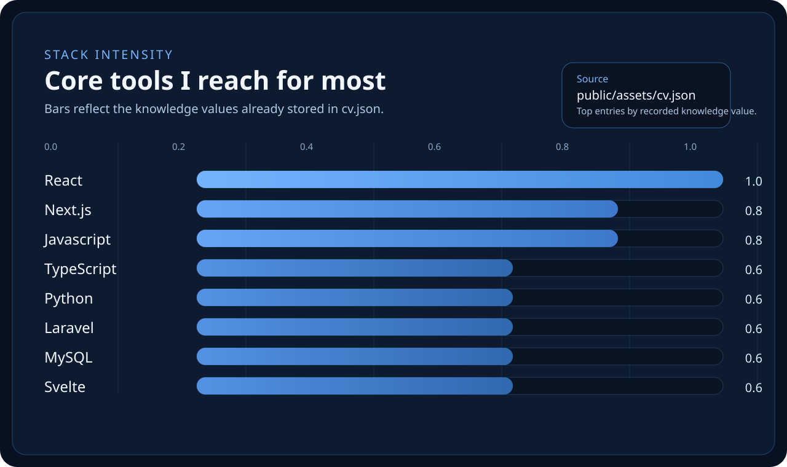
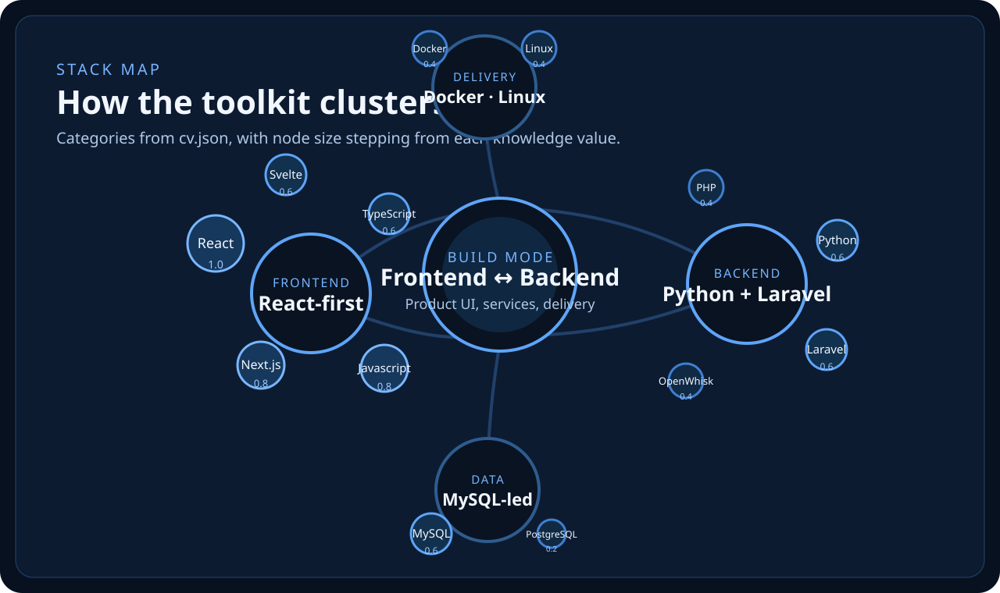

  

  Frontend-focused full-stack developer shipping product UI with <strong>React</strong>, <strong>TypeScript</strong>, and <strong>Python</strong>.

  I like turning PoCs into production, keeping the frontend sharp, and wiring the backend only as heavy as the product needs.

## Current build mode

- UI-first delivery with React / Next.js
- Python, Laravel, and serverless when workflows move behind the interface
- Based in Italy · open to the right EU relocation move

## Experience snapshot

- **Nuvolaris** — Python Developer · 10/2025–Present  
  React/Svelte frontends, Python/OpenWhisk services, AI extraction workflows, production cluster delivery.
- **Aroma S.r.l.** — Full-Stack Developer · 10/2024–06/2025  
  React architecture, Laravel features, Docker/Linux deployments.
- **Loliv** — Full-Stack Developer · 06/2024–12/2024  
  Built the app across frontend, backend, data, and a small delivery team.

## Reach out

- GitHub — [94lama](https://github.com/94lama)
- LinkedIn — [riccardo-la-malfa](https://www.linkedin.com/in/riccardo-la-malfa)
- Email — [info@riccardolamalfa.it](mailto:info@riccardolamalfa.it)
