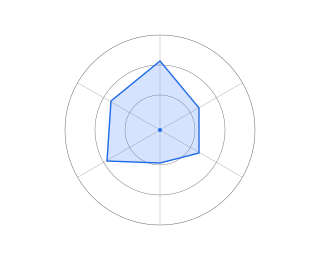

# Frontend‑focused Full‑Stack Engineer

I build product UIs and the backend glue that makes them work: typed frontends, pragmatic APIs, and small, testable services. I prefer incremental delivery, clear interfaces, and straightforward engineering tradeoffs.

## Working set

  <!-- Frontend (blue) -->
  <svg xmlns="http://www.w3.org/2000/svg" width="86" height="18" viewBox="0 0 86 18" role="img" aria-label="React badge"><rect rx="9" width="86" height="18" fill="#1f6be6"/><text x="43" y="12" font-family="Segoe UI, Arial, sans-serif" font-size="10" fill="#fff" text-anchor="middle">React</text></svg>
  <svg xmlns="http://www.w3.org/2000/svg" width="72" height="18" viewBox="0 0 72 18" role="img" aria-label="Next.js badge"><rect rx="9" width="72" height="18" fill="#1f6be6"/><text x="36" y="12" font-family="Segoe UI, Arial, sans-serif" font-size="10" fill="#fff" text-anchor="middle">Next.js</text></svg>
  <svg xmlns="http://www.w3.org/2000/svg" width="72" height="18" viewBox="0 0 72 18" role="img" aria-label="Svelte badge"><rect rx="9" width="72" height="18" fill="#1f6be6"/><text x="36" y="12" font-family="Segoe UI, Arial, sans-serif" font-size="10" fill="#fff" text-anchor="middle">Svelte</text></svg>
  <svg xmlns="http://www.w3.org/2000/svg" width="86" height="18" viewBox="0 0 86 18" role="img" aria-label="TypeScript badge"><rect rx="9" width="86" height="18" fill="#1f6be6"/><text x="43" y="12" font-family="Segoe UI, Arial, sans-serif" font-size="10" fill="#fff" text-anchor="middle">TypeScript</text></svg>
  <svg xmlns="http://www.w3.org/2000/svg" width="74" height="18" viewBox="0 0 74 18" role="img" aria-label="Tailwind badge"><rect rx="9" width="74" height="18" fill="#1f6be6"/><text x="37" y="12" font-family="Segoe UI, Arial, sans-serif" font-size="10" fill="#fff" text-anchor="middle">Tailwind</text></svg>

  <!-- Backend (green) -->
  <svg xmlns="http://www.w3.org/2000/svg" width="60" height="18" viewBox="0 0 60 18" role="img" aria-label="Python badge"><rect rx="9" width="60" height="18" fill="#16a34a"/><text x="30" y="12" font-family="Segoe UI, Arial, sans-serif" font-size="10" fill="#fff" text-anchor="middle">Python</text></svg>
  <svg xmlns="http://www.w3.org/2000/svg" width="90" height="18" viewBox="0 0 90 18" role="img" aria-label="OpenWhisk badge"><rect rx="9" width="90" height="18" fill="#16a34a"/><text x="45" y="12" font-family="Segoe UI, Arial, sans-serif" font-size="9.5" fill="#fff" text-anchor="middle">OpenWhisk</text></svg>
  <svg xmlns="http://www.w3.org/2000/svg" width="66" height="18" viewBox="0 0 66 18" role="img" aria-label="Laravel badge"><rect rx="9" width="66" height="18" fill="#16a34a"/><text x="33" y="12" font-family="Segoe UI, Arial, sans-serif" font-size="10" fill="#fff" text-anchor="middle">Laravel</text></svg>
  <svg xmlns="http://www.w3.org/2000/svg" width="44" height="18" viewBox="0 0 44 18" role="img" aria-label="PHP badge"><rect rx="9" width="44" height="18" fill="#16a34a"/><text x="22" y="12" font-family="Segoe UI, Arial, sans-serif" font-size="10" fill="#fff" text-anchor="middle">PHP</text></svg>

  <!-- DevOps (teal) -->
  <svg xmlns="http://www.w3.org/2000/svg" width="56" height="18" viewBox="0 0 56 18" role="img" aria-label="Docker badge"><rect rx="9" width="56" height="18" fill="#0ea5a4"/><text x="28" y="12" font-family="Segoe UI, Arial, sans-serif" font-size="10" fill="#fff" text-anchor="middle">Docker</text></svg>
  <svg xmlns="http://www.w3.org/2000/svg" width="62" height="18" viewBox="0 0 62 18" role="img" aria-label="CI CD badge"><rect rx="9" width="62" height="18" fill="#0ea5a4"/><text x="31" y="12" font-family="Segoe UI, Arial, sans-serif" font-size="10" fill="#fff" text-anchor="middle">CI/CD</text></svg>

  <!-- Databases (purple) -->
  <svg xmlns="http://www.w3.org/2000/svg" width="64" height="18" viewBox="0 0 64 18" role="img" aria-label="MySQL badge"><rect rx="9" width="64" height="18" fill="#8b5cf6"/><text x="32" y="12" font-family="Segoe UI, Arial, sans-serif" font-size="10" fill="#fff" text-anchor="middle">MySQL</text></svg>
  <svg xmlns="http://www.w3.org/2000/svg" width="100" height="18" viewBox="0 0 100 18" role="img" aria-label="PostgreSQL badge"><rect rx="9" width="100" height="18" fill="#8b5cf6"/><text x="50" y="12" font-family="Segoe UI, Arial, sans-serif" font-size="10" fill="#fff" text-anchor="middle">PostgreSQL</text></svg>

  <!-- Agentic AI (indigo) -->
  <svg xmlns="http://www.w3.org/2000/svg" width="92" height="18" viewBox="0 0 92 18" role="img" aria-label="Agentic AI badge"><rect rx="9" width="92" height="18" fill="#7c3aed"/><text x="46" y="12" font-family="Segoe UI, Arial, sans-serif" font-size="10" fill="#fff" text-anchor="middle">Agentic AI</text></svg>

  <!-- Architecture (orange) -->
  <svg xmlns="http://www.w3.org/2000/svg" width="92" height="18" viewBox="0 0 92 18" role="img" aria-label="Architecture badge"><rect rx="9" width="92" height="18" fill="#f97316"/><text x="46" y="12" font-family="Segoe UI, Arial, sans-serif" font-size="10" fill="#fff" text-anchor="middle">Architecture</text></svg>

## Skill graph (roles)

## What I ship

- Product UIs and component systems from PoC to production  
- APIs & backend systems: small REST/GraphQL services, serverless functions, background workers and scheduled jobs, database schema & migrations  
- Data extraction and workflow automation that integrates into product flows  
- Repeatable delivery: CI, container builds, deployment scripts

## How I work

- Small, focused PRs with clear intent and reviewable scope  
- Prefer minimal, maintainable abstractions over premature generalization  
- Incremental delivery: working UI and API early, then iterate on reliability and performance  
- Decisions and context documented in PR descriptions and short ADRs when helpful

## Contact

- LinkedIn: https://www.linkedin.com/in/riccardo-la-malfa  
- Email: info@riccardolamalfa.it
