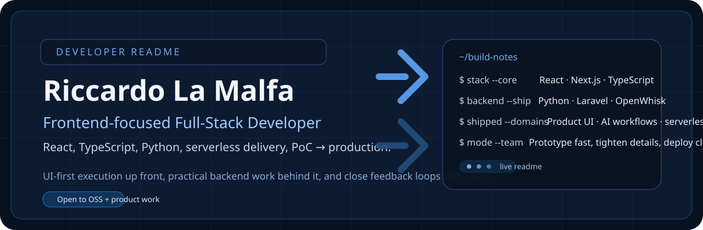

  

# Riccardo La Malfa

Frontend-focused full-stack developer building product-facing interfaces, Python-backed services, and the glue that gets ideas from PoC to production.

I like shipping work that feels sharp in the UI, stays practical in the backend, and keeps engineering conversations close to what users actually need.

## Current focus

- Building with **React, Next.js, TypeScript, and Python**
- Turning prototypes into production-ready product work
- Working on **serverless delivery, AI-assisted workflows, and clean developer experience**
- Looking for teams where frontend ownership and cross-stack execution both matter

## Toolbox

**Core stack**

- Frontend: React, Next.js, Svelte, JavaScript, TypeScript, Tailwind
- Backend: Python, PHP, Laravel, Django, OpenWhisk serverless apps
- Delivery: Docker, CI/CD, Linux, Bash
- Data: MySQL, PostgreSQL

**What I usually bring to a project**

- UI implementation with a strong eye for structure, hierarchy, and polish
- Full-stack feature delivery instead of frontend-only handoff work
- Comfort moving between product discussions, implementation details, and deployment steps
- Pragmatic collaboration with design, engineering, and client-facing stakeholders

## Selected work

### Nuvolaris — Python Developer

- Built front-end applications from PoC to production with **React** and **Svelte**
- Shipped serverless applications with **Python** and **OpenWhisk** backends
- Worked on **AI-based workflows** for extraction and processing tasks
- Presented technical solutions to clients and helped deploy production infrastructure on Kubernetes

### Aroma S.r.l. — Full-Stack Developer

- Developed scalable frontend architecture with **React**
- Implemented product features across frontend and **Laravel** backend layers
- Managed deployments with **Docker** and Linux environments

### Loliv — Full-Stack Developer

- Designed and built both the front-end application and backend application
- Managed database architecture and deployment work
- Coordinated a small technical team while still shipping hands-on

### Projects and side tracks

- Contribution to **Apache OpenServerless** (Python)
- **WireGuard VPN** setup work on Linux
- Client website development with **React** and **Tailwind CSS**

## Working style

- I enjoy projects where shipping fast does not mean shipping sloppy
- Best fit is collaborative product work: clear tradeoffs, direct feedback, iterative delivery
- I like owning the connective tissue between interface, backend behavior, and release workflow
- Strong interest in open source, developer tooling, and systems that balance UX with operational simplicity

## Find me

- GitHub: [github.com/94lama](https://github.com/94lama)
- LinkedIn: [riccardo-la-malfa](https://www.linkedin.com/in/riccardo-la-malfa)
- Email: [info@riccardolamalfa.it](mailto:info@riccardolamalfa.it)
- Base: Italy · open to EU relocation
